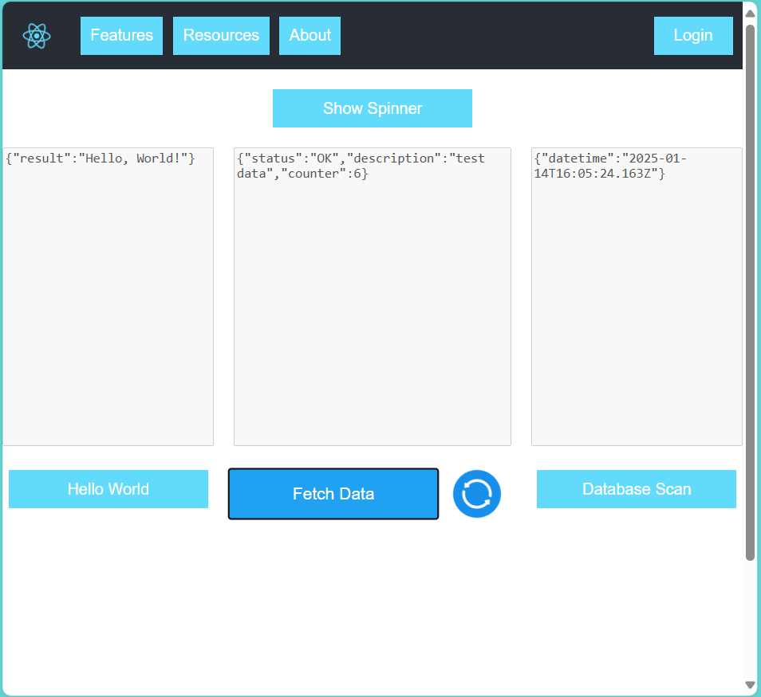
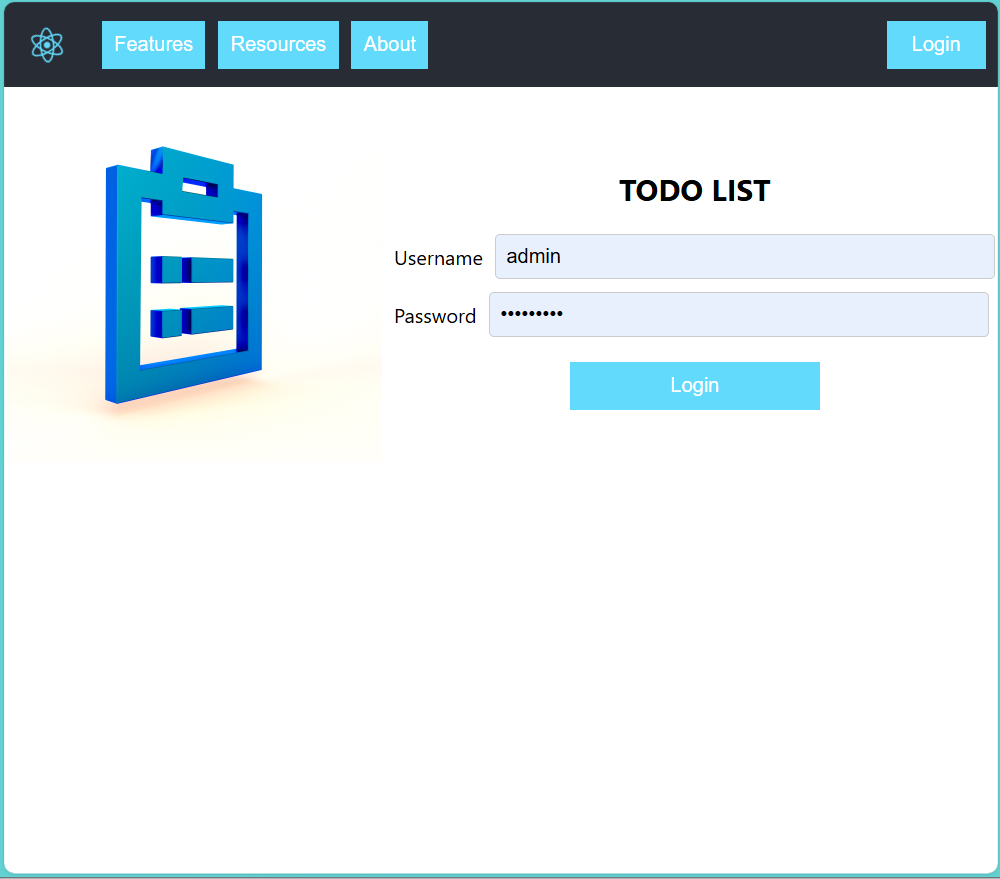
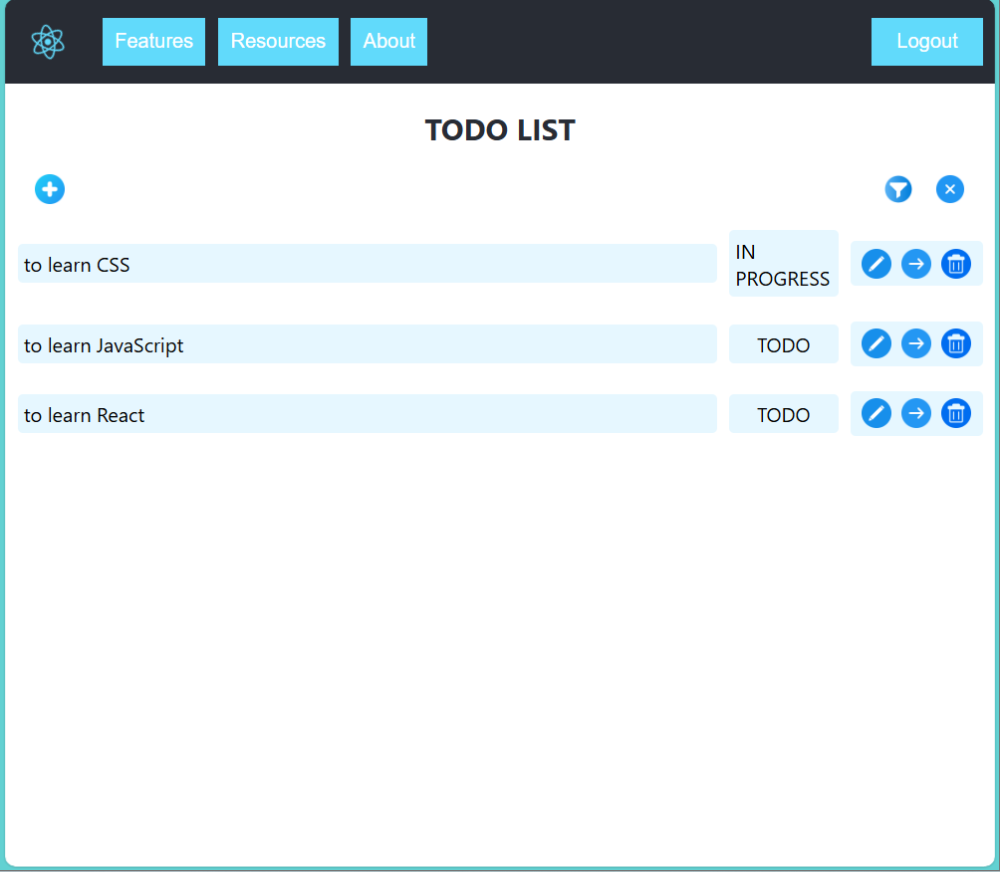
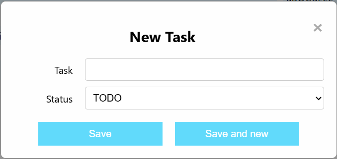
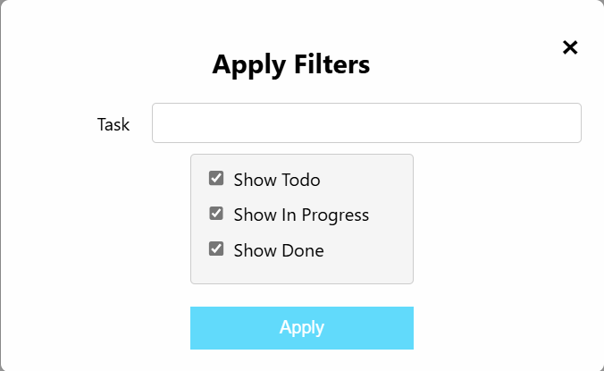
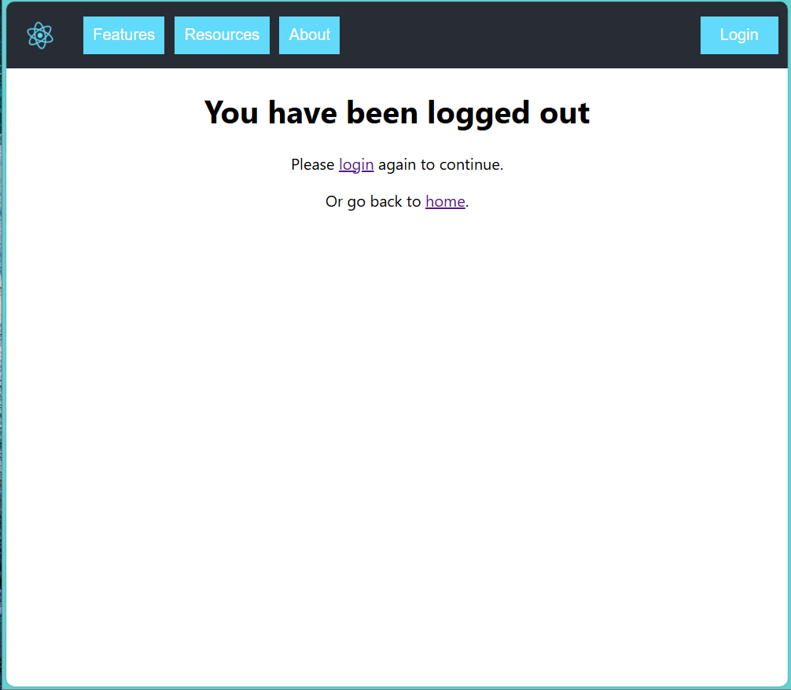

# Playground Frontend

 The goal of the Playground projects is to create a demonstration application using React and a Node.js backend. This aims to provide a minimal example of how the involved technologies work. The implementation follows an incremental development approach, allowing for the integration of new software tools over time. This fosters a deeper understanding before their deployment in more  complex projects.

 The scenario considered is a classic TodoList, which involves a list of tasks saved in a Postgres database, accompanied by a table of users authorized to interact with it.

 The project consists of a single-page application, where navigation is managed through a top menu. From here, you can access the main features, a series of useful links, and modals related to image sources and the team involved in the project.

 On the same toolbar, there is a Login button that allows access to the authenticated functionalities of the TodoList.

 See [Playground Server](https://github.com/AleDeP10/playground-server) to explore the endpoints exploited by the application.


## Main Features

### Home Endpoints

 The purpose of the home screen is to provide access to the server's unauthenticated endpoints, which are useful for verifying the backend's operation and the connection to the database.

 It consists of three text areas and their respective upload buttons, which will display the JSON returned by the APIs. Each of them is accompanied by an independent local spinner, which does not block the interface's operation and will continue spinning for an arbitrary period of five seconds before displaying the result.

 Above the text areas, there is a button to display the global spinner, an alternative to local spinner which shows a modal that will prevent user to interact with UI until the end of evaluation.

 

### Login component

 The Login screen can be accessed by clicking on the respective button at the top right or by attempting to access the TodoList without authentication.

 

### Todo List

 The main functionality of the project allows for performing CRUD operations on the TodoList. Therefore, buttons for creating a new Task and for filtering them are displayed, followed by the list of items that match the selected display settings. Each of them has three action buttons:
 - Edit: opens the modal to update the selected task
 - Next Status: moves the item’s status (TODO | IN PROGRESS | DONE) to the next one
 - Delete: removes the specified task from the database

 

 The same modal is used for creating and editing Tasks. There is also a `Save and new` button to allow for the easy creation of new items one after another.

 

 The default settings hide items in the DONE state. It is possible to modify the applied filters through the dedicated modal. In addition to the state, a LIKE filter on the Task description is also provided.

 The application uses a Zustand store for caching the Task list: this means that interacting with the filters does not require subsequent requests to the server, which will only be made when data alterations are performed by other APIs.

 

### Logout component
 
 The authentication tokens issued by the server have an expiration time of 15 minutes. After such an interval of inactivity, requests will fail, and the frontend will render the disconnection screen, allowing users to return to the login page or go to the home endpoints.

 


## Involved Technologies

### Axios

 The project uses `Axios` as the HTTP client to manage requests to the server endpoints. 

 Each authenticated interaction is processed by an interceptor that checks for a token in localStorage and adds it to the authorization header.

 Sure, here’s the continuation of your translation:

 The same interceptor is used to centralize error handling in cases where the response contains a status code other than SUCCESS:
 - In the case of token expiration due to inactivity (status code `403`), the store is notified so that the UI loads the Logout component.
 - For other errors, the error message is extracted and displayed directly on the interface with a timeout of five seconds.

### Zustand

 `Zustand` is a small, fast, and scalable state management library for React applications. It provides a simple API for creating and managing global state without the boilerplate often associated with other state management solutions. Zustand uses hooks to interact with the state, making it easy to read and update data within components.

### dotenv

**Description**:
 `dotenv` is a zero-dependency module that loads environment variables from a `.env` file into `process.env`. This is especially useful for keeping sensitive configurations like database credentials and secret keys out of your codebase.

**Example Configuration**:
```plaintext
REACT_APP_SERVER_URL=http://localhost:5000
REACT_APP_ADMIN_USERNAME=admin
REACT_APP_ADMIN_PASSWORD=<password>
```
 In this project, `dotenv` is used to load environment configurations required for connecting to server and admin credentials (used by end-to-end unit test).


## Project Setup

 Follow these steps to set up the project and get it running on your local machine.

### 1. Clone the repository

 First, clone the repository to your local machine using Git:

```bash
git clone https://github.com/AleDeP10/playground-frontend.git
```


### 2. Install dependencies

 Navigate to the root directory of the project and install the required dependencies using npm:

```bash
npm install
```

### 3. Start the server

 Make sure the `playground-server` is running (follow the setup guide in relative README.md).

### 4. Start the application

 Start the frontend with the following command:

```bash
npm start
```

 The frontend should now be running and accessible through the browser.

 ## End-to-end Unit Tests

 End-to-end tests written with `Jest` have been implemented to verify that the responses returned by the server for each API meet the expectations. To perform this verification, simply ensure that the server is running and run the tests with the command:
 
```bash
npm test
```
